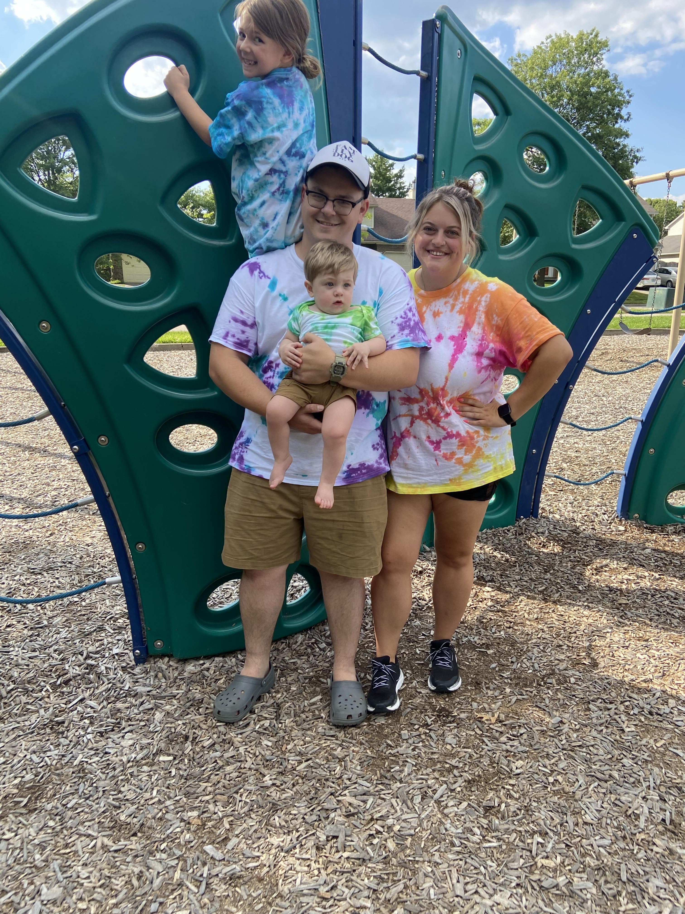
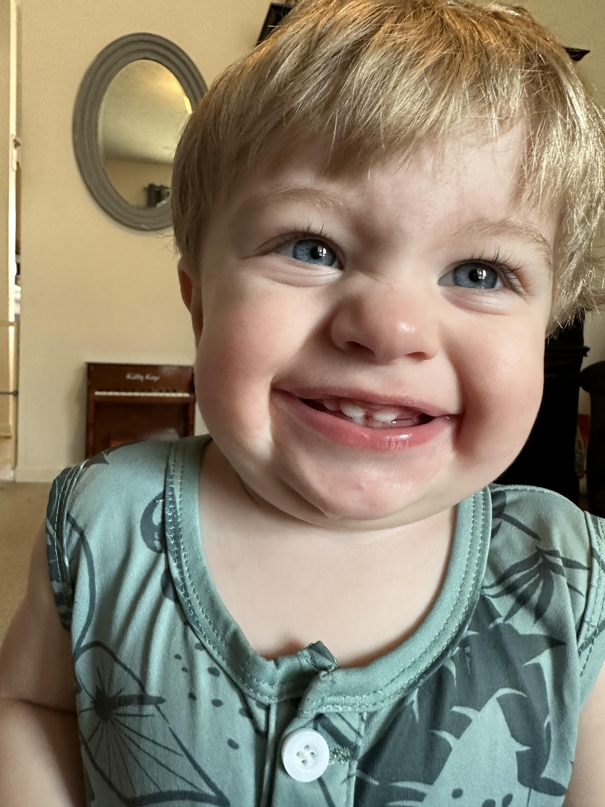

# Tanner McDaniel
## Blog about my BootCamp Experience
###### This first week of bootcamp has been incredibly challenging and incredibly rewarding. I did not expect how difficult it would be to understand Git and GitPod. GitHub makes a lot more sense to me, but using CLI and using GitPod in VSCode in general. Overall though I am very excited to continue to learn more. The rush I get when I finally figure out what I am working on is amazing.

Something about me that you can only learn reading this blog is that I was a complete technology idiot coming into this program. I have very little background in technology and learning to code is a very scary concept for me. 

Additionally, I am a family man first. My daughter Mayson Grace and my son Noah Brooks are the two things in this world that keep me going. My girlfriend Keylee is an amazing partner that pushes me to be the best version of myself and loves my kids like they are her own. 

