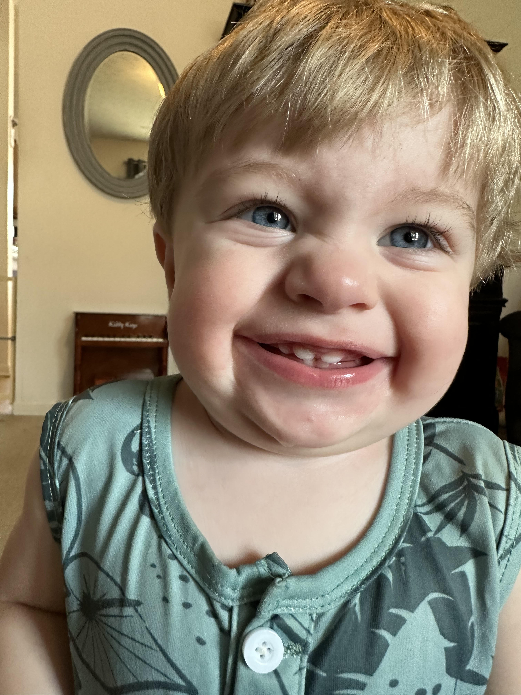

# Tanner McDaniel
## Blog about my BootCamp Experience

#### Week 1

This first week of bootcamp has been incredibly challenging and incredibly rewarding. I did not expect how difficult it would be to understand Git and GitPod. GitHub makes a lot more sense to me than using CLI and GitPod in VSCode in general. Overall though I am very excited to continue to learn more. The rush I get when I finally figure out what I am working on is amazing.

Something about me that you can only learn reading this blog is that I was a complete technology idiot coming into this program. I have very little background in technology and learning to code is a very scary concept for me. 

Additionally, I am a family man first. My daughter Mayson Grace and my son Noah Brooks are the two things in this world that keep me going. My girlfriend Keylee is an amazing partner that pushes me to be the best version of myself and loves my kids like they are her own.

#### Week 2

The second week of bootcamp was centered around material I am much more comfortable with. HTML and CSS are things we practiced in the prework section before beginning the bootcamp so I had something of a grasp on these concepts before we even started week 2. This made me have a sense of confidence that I would be able to complete the project and make it to demo day confindently, which I did achieve. I will say though I was impressed when Will was able to use Javascript to make the little bird jump around his webpage. That is something I wish I knew how to do and will work towards learning.

I solve problems by researching first, exhausting all my personal resources to find an answer. If this does not work then I tend to reach out and ask for help from the group. Collaboration and helping your peers is something that I believe not only makes for a strong team but makes for stronger individuals. I tend to get myself unstuck by asking for help, or also by simply walking away from the computer for a while, thinking about the situation critically and coming back to it with a fresh set of eyes. 

I am excited, but nervous for week 3. Javascript is something I struggled with in the prework but something I do hope to get much better at. 
